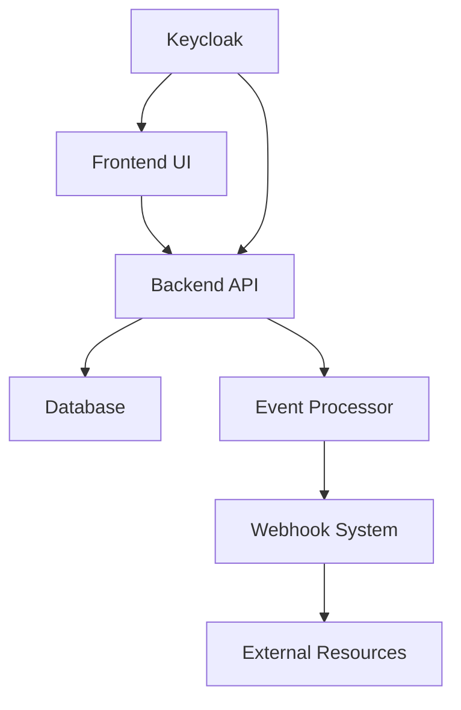

# Cloud Resource Reservation System Overview

Welcome to the **Cloud Resource Reservation System** - a comprehensive platform designed to automate and manage cloud resource reservations with intelligent webhook integration.

## System Architecture

The Cloud Resource Reservation System is built using a modern microservices architecture with the following key components:

### Core Services

- **🖥️ reservation-fe**: React-based frontend application providing an intuitive user interface
- **🔌 reservation-be**: Backend service handling business logic, APIs, and database operations
- **⚡ reservation-event-processor**: Event-driven microservice for asynchronous processing
- **🔑 Keycloak**: Authentication and authorization service
- **🗄️ PostgreSQL**: Database for persistent data storage

### Infrastructure Components

- **🐳 Docker & Docker Compose**: Containerization and local development environment
- **☸️ prognose-helm-chart**: Kubernetes deployment using Helm charts
- **🔗 Webhook System**: Extensible webhook framework for resource integration

## How Components Interact

1. **User Interaction**: Users interact with the React frontend to create reservations and configure resources
2. **API Layer**: The backend provides RESTful APIs secured with Keycloak authentication
3. **Event Processing**: Asynchronous events are processed by the event processor microservice
4. **Webhook Integration**: Custom webhooks enable integration with external resource providers
5. **Data Persistence**: All data is stored in PostgreSQL with proper transaction management

## Key Features

### 🎯 Resource Management
- Create and manage cloud resource reservations
- Track resource availability and usage
- Automated resource lifecycle management

### 🔗 Webhook Integration
- Extensible webhook framework for custom integrations
- Python-based webhook examples (like `polito-switch-port-webhook`)
- Real-time event processing and notifications

### 🔐 Security & Authentication
- Keycloak-based authentication and authorization
- Role-based access control (RBAC)
- Secure API endpoints with JWT tokens

### 🚀 Deployment & Scalability
- Docker containerization for consistent deployments
- Kubernetes support with Helm charts
- Microservices architecture for horizontal scaling

## Getting Started

To get started with the Cloud Resource Reservation System:

1. **Development Environment**: Use Docker Compose for local development
2. **Production Deployment**: Deploy using Kubernetes with Helm charts
3. **Webhook Integration**: Follow our [Webhooks Guide](./guides/webhooks.md) to integrate custom resources

## Demo Environment

A live demo is available at:
- **URL**: https://204.216.215.139/
- **Username**: admin
- **Password**: password

For local development, check out the [main repository](https://github.com/giovannimirarchi420/cloud-resource-reservation) for setup instructions.
